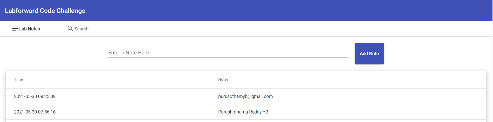
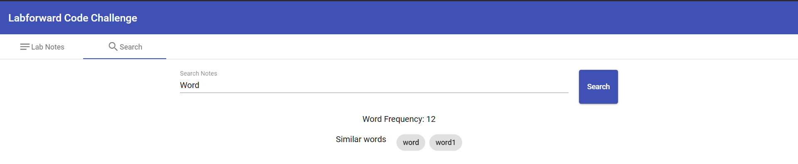

# Labforward Code Challenge - UI

This project contains UI codebase for Labforward code challenge.

## Scope of work
UI is developed with Angular 10 and Angular Material Components to support the REST endpoints.

  Technology stack: Typescript, Angular 10, Angular Material Design Components

## UI Screens
* Add notes UI screen

* Search notes UI screen

## Further enhancements
* Code coverage
* Pagination,Sorting to navigate Lab notes from UI
* Better UI aesthetics and validations

## Local Development

Run `ng serve` for a dev server. Navigate to `http://localhost:4200/`. The app will automatically reload if you change any of the source files.
 Also, the following line has to uncomment in [labforward-task](https://github.com/purushred/labforward-task) codebase to integrate with spring-boot backend.
 File: `NotesController.java`
 Line: `//@CrossOrigin(origins = "http://localhost:4200")`

## Build

Run `ng build` to build the project. The build artifacts will be stored in the `dist/` directory. Use the `--prod` flag for a production build.